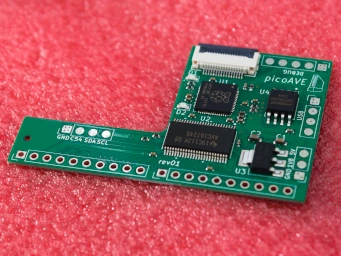
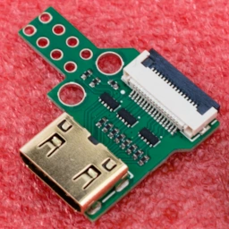

## Required parts

* picoAVE mainboard
<br />
* HDMI adapter board
<br />
* Bridge flex pcb (orange)
* FFC flex cable
  * 10cm (3.9in) is fine, but preferably shorter. I guess 7cm (2.75in) would fit best if you can source one (untested).
  * 16 pin
  * 0.5mm pitch
  * ends need their pins on opposite sides (there is a 90° bend during install)

#### Ordering

All PCBs were designed to be ordered easily and for cheap at JLCPCB. The KiCAD project files for each PCB can be found in `hardware/.../`. The following instructions need to be done for all 3 of them. Use the [Fabrication Toolkit plugin](https://github.com/bennymeg/Fabrication-Toolkit) to export all required files to a subfolder called `hardware/.../production/`. Start with the generated zip file and upload it to their ordering page.

For the main and HDMI adapter board make sure to select the following options:
* PCB thickness: 0.8mm
* Mark on PCB:  Order Number (specify position)
  
Then:
* Activate the PCB assembly slider (in case it asks: you don't need panelization)
* Make sure to use economic assembly
* Assemble top side
* Select a quantity of
  * 2 for the mainboard
  * 5 for the adapter board, which I highly recommend as it does cost less than 1€ to order these 3 additional boards and I already had a defect in 1 out of 5 boards (HDMI connector pins shorted)

Furher on you need to upload the generated `bom.csv` and `positions.csv`.

Later during checkout make sure to have the SMT assembly coupon activated, you might need to redeem it first on their coupon center page in case it is missing. Sadly you have to pass checkout seperately for each PCB, because you can only apply one coupon at a time.

For the bridge flex pcb, select:
* Base material: flex
* Mark on PCB:  Order Number (specify position)

## Assembly steps

#### Mainboard + Bridge pcb
1. Solder the bridge pcb onto the back of the picoAVE mainboard.
2. Remove the solder mask from necessary vias on the Wii mainboard. A tiny flat head screw driver can be used to just scrape it off and works well. **Be gentle and use almost no pressue!** Make sure to remove accumulated dust.
3. Apply flux to the now exposed vias.
4. Apply solder to the tip of your iron and attach a small ball of solder onto each via. Make sure there are no shorts/bridges. If it won't stick, try scraping more.
5. Place and align the bridge pcb onto the solder balls. Then apply solder over all holes evenly until the pcb is firmly pulled towards the Wii mainboard. There must not be a gap between both pcbs. Again, make sure there are no bridges.
6. For each signal, check for continuity between the picoAVE mainboard and corresponding pins on the AVE-RVL chip to ensure good contact.

## Flashing firmware

Best done with a Raspberry Pi or another Pico you have available.

With a Raspberry Pi you can use [OpenOCD](https://openocd.org/) to flash the main board over SWD using two GPIO pins, e.g. 23 and 24. The following config should be saved as `openocd.cfg`.

```ini
source [find interface/raspberrypi-native.cfg]

adapter gpio swclk 23
adapter gpio swdio 24

set CHIPNAME rp2040
source [find target/rp2040.cfg]
adapter speed 100 

init
targets
reset halt
program picoave.elf verify
reset run
shutdown
```

OpenOCD can then be started by `sudo openocd` in the same directory. Flashing will only take a few seconds.

### Connections

| Signal | RPi Pin |
| ------ | :-----: |
| SWCLK  | 23      |
| SWDIO  | 24      |
| GND    | any GND |